  

## 📌 About Me
- "I'm passionate about building high-quality software, from architecture to implementation".
- That is more than just a tagline for me; it's the core principle that guides my work and studies. For me, software techineering is a craft that balances art and science, and my goal is to master both sides.☕⚡

## 📊 GitHub Stats & Trophies

  

  

  

## 🛠️ Languages & Tools

<h3 align="center">Programming Languages</h3>

  &nbsp;&nbsp;
  &nbsp;&nbsp;
  &nbsp;&nbsp;
  

<h3 align="center">Frontend</h3>

  &nbsp;&nbsp;
  

<h3 align="center">Backend</h3>

  

<h3 align="center">Database</h3>

  &nbsp;&nbsp;
  

<h3 align="center">DevOps & Cloud</h3>

  

<h3 align="center">Tools</h3>

  &nbsp;&nbsp;
  &nbsp;&nbsp;
  

 

## 🔗 Connect with Me

  &nbsp;&nbsp;
  

  

